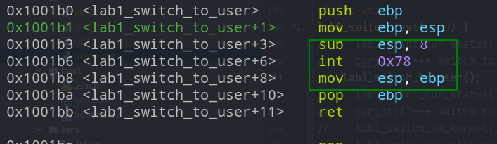
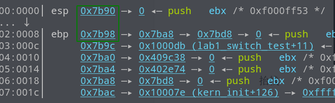
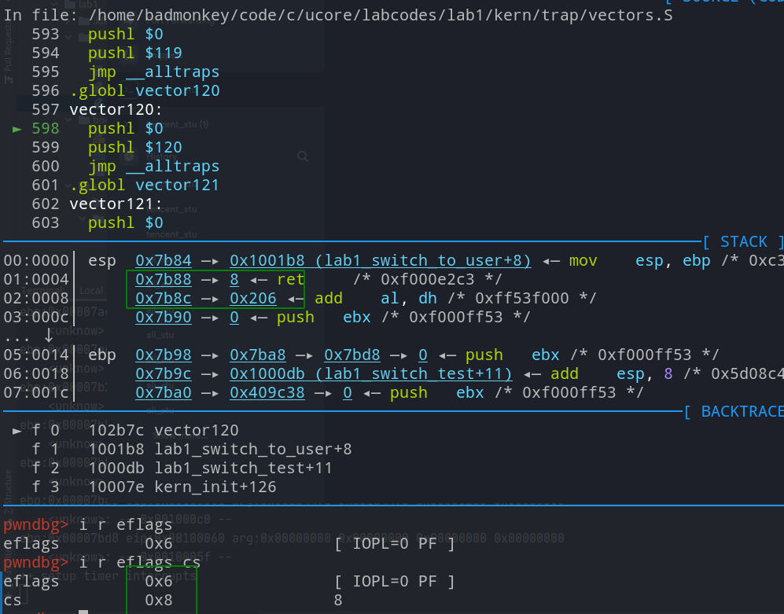
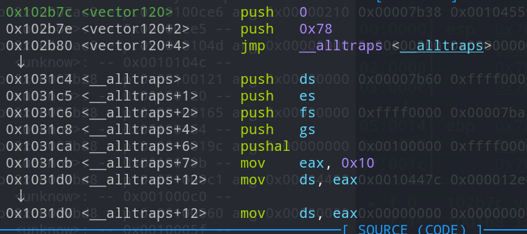
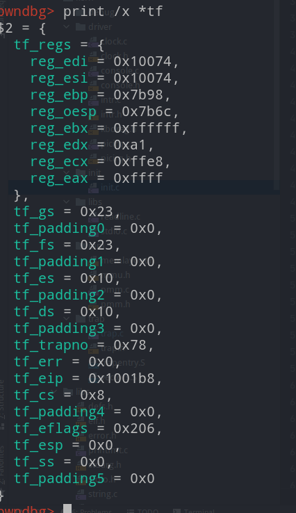

# Lab1 summary

lab1还是比较基础的，将很多学过的东西重新串联了起来，加深了对os的理解，这里记录一下学习过程中的一些比较重要的内容。

## 操作系统的加载

 之前的理解有误，bios和bootloader不是一个东西。bios是在rom中的一段程序用于开机时初始化硬件，并进行自检。在ucore中并没有bios的代码，而是使用qemu自带的bios。不过bios会将bootloader的代码加载到内存中(0x7c00),这段代码是存在的，

即`boot`文件夹下对应的几个文件。

> bootloader的代码放在逻辑1扇区，bios会加载第一扇区的代码，并跳过去执行

**bootloader**

那么bootloader会干什么事情呢?其实主要干了两件事情，**建立全局描述符表，并切换到保护模式**。

在切换到保护模式前，需要开启a20，这部分需要通过io操作实现，即读写io端口。

```assembly
# Enable A20:
#  For backwards compatibility with the earliest PCs, physical
#  address line 20 is tied low, so that addresses higher than
#  1MB wrap around to zero by default. This code undoes this.
seta20.1:
    inb $0x64, %al                                  # Wait for not busy(8042 input buffer empty).
    testb $0x2, %al                                 # 如果 %al 第低2位为1，则ZF = 0, 则跳转
    jnz seta20.1                                    # 如果 %al 第低2位为0，则ZF = 1, 则不跳转

    movb $0xd1, %al                                 # 0xd1 -> port 0x64
    outb %al, $0x64                                 # 0xd1 means: write data to 8042's P2 port

seta20.2:
    inb $0x64, %al                                  # Wait for not busy(8042 input buffer empty).
    testb $0x2, %al
    jnz seta20.2

    movb $0xdf, %al                                 # 0xdf -> port 0x60
    outb %al, $0x60                                 # 0xdf = 11011111, means set P2's A20 bit(the 1 bit) to 1
```

GDT建立则分为两部分

```assembly
# Bootstrap GDT
.p2align 2                                          # force 4 byte alignment
gdt:
    SEG_NULLASM                                     # null seg
    SEG_ASM(STA_X|STA_R, 0x0, 0xffffffff)           # code seg for bootloader and kernel
    SEG_ASM(STA_W, 0x0, 0xffffffff)                 # data seg for bootloader and kernel

gdtdesc:
    .word 0x17                                      # sizeof(gdt) - 1   16bit
    .long gdt                                       # address gdt       32bit
```

第一部分是gdtdesc描述了gdt的项数和gdt的地址，第二部分是实际的gdt表，注意第一项始终为空。

切换到保护模式需要更改cr0寄存器的控制位，同时更改一系列段寄存器的值。

```assembly
    lgdt gdtdesc
    movl %cr0, %eax    # cr0 控制寄存器
    orl $CR0_PE_ON, %eax
    movl %eax, %cr0    # 启动保护模式

    # Jump to next instruction, but in 32-bit code segment.
    # Switches processor into 32-bit mode.
    ljmp $PROT_MODE_CSEG, $protcseg # 将$PROT_MODE_CSEG 选择子 写入cs寄存器，通过gdt选择对应的段基址，然后跳转

.code32                                             # Assemble for 32-bit mode
protcseg:
    # Set up the protected-mode data segment registers
    movw $PROT_MODE_DSEG, %ax                       # Our data segment selector
    movw %ax, %ds                                   # -> DS: Data Segment
    movw %ax, %es                                   # -> ES: Extra Segment
    movw %ax, %fs                                   # -> FS
    movw %ax, %gs                                   # -> GS
    movw %ax, %ss                                   # -> SS: Stack Segment

    # Set up the stack pointer and call into C. The stack region is from 0--start(0x7c00)
    movl $0x0, %ebp
    movl $start, %esp
    call bootmain # 调用bootmain，此后由bootmain接管并加载os
```

bootmain接管后的逻辑也比较简单，读取位于第二扇区(读了很多个扇区)的os的elf文件，然后根据elf的信息，读取对应的program header并依次加载到内存中，最后进入os的entry执行。具体的代码详见`boot/bootmain.c`。操作系统的加载到此就结束了，相对来说还是比较好理解的。

## 运行操作系统内核

操作系统被加载后会进入其elf文件的entry然后运行，但是在工程文件中看起来没有一个`main`函数呀？内核又是怎么知道程序的入口点呢？实际上在链接kernel文件的时候使用一个链接脚本`kernel.ld`这个脚本中指定了entry为kern_init和kernel的elf布局。所以加载内核后会进入kern_init继续执行.

看一下kern_init都初始化了一些什么东西

```c
kern_init(void) {
    extern char edata[], end[];
    memset(edata, 0, end - edata);
    cons_init();                // init the console
    pmm_init();                 // init physical memory management 
    pic_init();                 // init interrupt controller
    idt_init();                 // init interrupt descriptor table
    clock_init();               // init clock interrupt
    intr_enable();              // enable irq interrupt
}
```

cons_init 做了一堆看不懂的东西(先留着

pmm_init初始化了一下tss和gdt

pic_init也不是很懂，大概是初始化了中断相关的东西。

idt_init初始化了中断描述符表。

clock_init则是初始化了时钟中断

intr_enable开启可屏蔽中断。

lab1主要做的还是中断相关的内容，这里简单记录一下中断的部分。

### 中断

首先在vector.S定义了256个中断号，每个中断号都会将其压栈，不过有些中断在压入中断号之前会压入0。压入后跳转到统一的中断处理程序__alltraps这个函数会将寄存器压栈(保存现场)，具体的实现在trapentry.S中。同时设计了一个trapframe结构体用户保存trap时的寄存器相关信息(还有一个pushregs寄存器)。

**内核态切换为用户态**

手动的抬栈，空出两个位置留给ss和esp寄存器，因为trapframe最后是在栈上的，且栈顶为低地址，所以结构的变量是倒序压栈的，即先压入ss,再压入esp,依次类推，最后压入gs,和通用寄存器。

```c
struct trapframe {
    struct pushregs tf_regs;
    uint16_t tf_gs;
    uint16_t tf_padding0;
    uint16_t tf_fs;
    uint16_t tf_padding1;
    uint16_t tf_es;
    uint16_t tf_padding2;
    uint16_t tf_ds;
    uint16_t tf_padding3;
    uint32_t tf_trapno;
    /* below here defined by x86 hardware */
    uint32_t tf_err;
    uintptr_t tf_eip;
    uint16_t tf_cs;
    uint16_t tf_padding4;
    uint32_t tf_eflags;
    /* below here only when crossing rings, such as from user to kernel */
    uintptr_t tf_esp;
    uint16_t tf_ss;
    uint16_t tf_padding5;
} __attribute__((packed));
```

可以看到`__alltraps`确实是这么做的，不过注意的是这里没有压入`ss`和`esp`所以需要自己手动抬栈然后补充上去。

```assembly
__alltraps:
    # push registers to build a trap frame
    # therefore make the stack look like a struct trapframe
    pushl %ds
    pushl %es
    pushl %fs
    pushl %gs
    pushal  # 压入通用寄存器
    
```

> 用户态转内核态的时候需要保存ss和esp,而内核态转用户态则不用，所以这里面的__alltraps没有压ss和esp,不然的话就没这么多事了。

切换到内核态的内联汇编，必须要包括`mov esp,ebp`因为编译器不检查内联汇编，需要手动完成函数调用后的栈恢复。



抬栈



int调用中断时，压入了三个东西，恰好对应了trapframe结构体中的eip,cs,eflags



然后进入中断保存现场(压栈构造trapframe)



构造完成后如下图所示



接下来就是根据对应的中断号进行不同的操作，如切换到用户态等等。

> 状态的切换只要更改trapframe中的寄存器的信息即可

## 后续

完成keyborad切换用户状态的代码。。。
