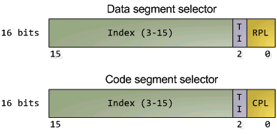

# ucore learning

> 实验环境: Manjaro Linux 21.0.5
>
> 编译器:clang 11.1.0
>
> 硬件模拟器:qemu
>
> 文档:https://objectkuan.gitbooks.io/
>
> 答案:https://oscourse-tsinghua.github.io/

## day1

编译器改用clang,gcc编译出来的bootloader会大于510字节。

https://github.com/chyyuu/os_kernel_lab/issues/50

**make流程**

1. 编译kernel源码并链接
2. 编译bootloader并链接(注意要小于510字节)，因为作为引导扇区(第一个block，一个block 512字节)
3. 将bootloader和kernel写入到一起,bootloader作为第一个block,kernel紧随其后

## day2

gdb 调试qemu启动的bios时，无法正确识别指令地址的问题。


https://stackoverflow.com/questions/62513643/qemu-gdb-does-not-show-instructions-of-firmware

https://stackoverflow.com/questions/32955887/how-to-disassemble-16-bit-x86-boot-sector-code-in-gdb-with-x-i-pc-it-gets-tr/32960272#32960272

这是由于bios启动的时候处于实模式，20位寻址空间，cs:eip的寻址模式，而gdb在计算地址时只考虑了eip,没有计算考虑cs寄存器，所以调试的时候会有问题。解决方法参考第一个stackoverflow


顺便回顾一下实模式和保护模式的概念

https://zhuanlan.zhihu.com/p/42309472

**实模式**，段寄存器:通用寄存器 => 段基址:段内偏移 16位寄存器 20位寻址空间 

**保护模式**,32位寄存器(段寄存器仍然是16位)，通用寄存器保存偏移，段寄存器不再保存段基址，而是保存全局描述符表(GDT)的索引，通过索引找到段描述符,段描述符记录了段的基址和相关信息(读写权限之类的)，用于保护段！！

需要注意的是，进入kernel后就是保护模式了，所以需要再改一下gdb的配置。

**A20 Gate**

a20是80286后产生的一个概念，由于80286有24根寻址线，寻址能力比8086高了16倍，为了向下兼容使用a20位表示是否启用80286的24位寻址。可以用于实模式到保护模式的转换，具体的如何开启a20是通过写io端口实现的。

**GDT表**

全局描述符表，保存多个段描述符，其地址在GDTR(全局描述表寄存器)，GDTR为48位，高32位为基址，低16位为段界限。lgdt汇编指令将gdt表地址加载到gdtr中

GDT表第一项为空段描述符，GDTR中的段界限为8*N-1其中N为段描述符的个数(包含空段描述符)

**段描述符**

64bit 8字节 结构如下

```c
/* segment descriptors */
struct segdesc {
    unsigned sd_lim_15_0 : 16;        // low bits of segment limit
    unsigned sd_base_15_0 : 16;        // low bits of segment base address
    unsigned sd_base_23_16 : 8;        // middle bits of segment base address
    unsigned sd_type : 4;            // segment type (see STS_ constants)
    unsigned sd_s : 1;                // 0 = system, 1 = application
    unsigned sd_dpl : 2;            // descriptor Privilege Level 特权级实现保护机制
    unsigned sd_p : 1;                // present
    unsigned sd_lim_19_16 : 4;        // high bits of segment limit 段界限粒度位为0时默认单位是字节
    unsigned sd_avl : 1;            // unused (available for software use)
    unsigned sd_rsv1 : 1;            // reserved
    unsigned sd_db : 1;                // 0 = 16-bit segment, 1 = 32-bit segment
    unsigned sd_g : 1;                // granularity: limit scaled by 4K when set 粒度 
    unsigned sd_base_31_24 : 8;        // high bits of segment base address
};
```

主要包括了段的基址，段的界限，段的属性(粒度，类型，特权级，存在位，访问位)


**选择子**

保护模式下16位的段寄存器，现在用来作为选择子(类似于索引的概念)而不是段基址。其中高13位为索引，倒数第三位为表指示位(LDT和GDT),最低的两位为请求特权级。



特权级有4中，最高特权级为0,最低特权级为3.ucore中0为内核态，3为用户态。

**特权级保护模型**

主要涉及到几个PL(privilege level)的概念

CPL(current privilege level)当前特权级，保存在cs寄存器的最低2位

DPL(Descriptor privilege level)描述符特权级，描述符表中的特权级也是两位

RPL(Request privilege level)请求特权级，选择子中的最低两位。


允许内核代码加载特权级比较低的段。注意对于堆栈寄存器要求CPL,RPL,DPL完全一致才可以被加载。

## day3

elf文件格式，bootloader在第一扇区，而os的elf文件在第二扇区，bios需要加载elf到内存中，这个过程是根据elf文件头的格式来进行的。bios会将elf中的代码段依次加载到内存中，然后执行elf的entry。
