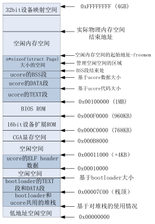

# ucore learning

> 实验环境: Manjaro Linux 21.0.5 + ubuntu 18.04
>
> 编译器:clang 11.1.0
>
> 硬件模拟器:qemu
>
> 文档:https://objectkuan.gitbooks.io/ucore-docs/content/
>
> 答案:https://oscourse-tsinghua.github.io/ucore-analysis/

## day1

编译器改用clang,gcc编译出来的bootloader会大于510字节。

https://github.com/chyyuu/os_kernel_lab/issues/50

**make流程**

1. 编译kernel源码并链接
2. 编译bootloader并链接(注意要小于510字节)，因为作为引导扇区(第一个block，一个block 512字节)
3. 将bootloader和kernel写入到一起,bootloader作为第一个block,kernel紧随其后

## day2

gdb 调试qemu启动的bios时，无法正确识别指令地址的问题。


https://stackoverflow.com/questions/62513643/qemu-gdb-does-not-show-instructions-of-firmware

https://stackoverflow.com/questions/32955887/how-to-disassemble-16-bit-x86-boot-sector-code-in-gdb-with-x-i-pc-it-gets-tr/32960272#32960272

这是由于bios启动的时候处于实模式，20位寻址空间，cs:eip的寻址模式，而gdb在计算地址时只考虑了eip,没有计算考虑cs寄存器，所以调试的时候会有问题。解决方法参考第一个stackoverflow


顺便回顾一下实模式和保护模式的概念

https://zhuanlan.zhihu.com/p/42309472

**实模式**，段寄存器:通用寄存器 => 段基址:段内偏移 16位寄存器 20位寻址空间 

**保护模式**,32位寄存器(段寄存器仍然是16位)，通用寄存器保存偏移，段寄存器不再保存段基址，而是保存全局描述符表(GDT)的索引，通过索引找到段描述符,段描述符记录了段的基址和相关信息(读写权限之类的)，用于保护段！！

需要注意的是，进入kernel后就是保护模式了，所以需要再改一下gdb的配置。

**A20 Gate**

a20是80286后产生的一个概念，由于80286有24根寻址线，寻址能力比8086高了16倍，为了向下兼容使用a20位表示是否启用80286的24位寻址。可以用于实模式到保护模式的转换，具体的如何开启a20是通过写io端口实现的。

**GDT表**

全局描述符表，保存多个段描述符，其地址在GDTR(全局描述表寄存器)，GDTR为48位，高32位为基址，低16位为段界限。lgdt汇编指令将gdt表地址加载到gdtr中

GDT表第一项为空段描述符，GDTR中的段界限为8*N-1其中N为段描述符的个数(包含空段描述符)

**段描述符**

64bit 8字节 结构如下

```c
/* segment descriptors */
struct segdesc {
    unsigned sd_lim_15_0 : 16;        // low bits of segment limit
    unsigned sd_base_15_0 : 16;        // low bits of segment base address
    unsigned sd_base_23_16 : 8;        // middle bits of segment base address
    unsigned sd_type : 4;            // segment type (see STS_ constants)
    unsigned sd_s : 1;                // 0 = system, 1 = application
    unsigned sd_dpl : 2;            // descriptor Privilege Level 特权级实现保护机制
    unsigned sd_p : 1;                // present
    unsigned sd_lim_19_16 : 4;        // high bits of segment limit 段界限粒度位为0时默认单位是字节
    unsigned sd_avl : 1;            // unused (available for software use)
    unsigned sd_rsv1 : 1;            // reserved
    unsigned sd_db : 1;                // 0 = 16-bit segment, 1 = 32-bit segment
    unsigned sd_g : 1;                // granularity: limit scaled by 4K when set 粒度 
    unsigned sd_base_31_24 : 8;        // high bits of segment base address
};
```

主要包括了段的基址，段的界限，段的属性(粒度，类型，特权级，存在位，访问位)


**选择子**

保护模式下16位的段寄存器，现在用来作为选择子(类似于索引的概念)而不是段基址。其中高13位为索引，倒数第三位为表指示位(LDT和GDT),最低的两位为请求特权级。


特权级有4中，最高特权级为0,最低特权级为3.ucore中0为内核态，3为用户态。

**特权级保护模型**

主要涉及到几个PL(privilege level)的概念

CPL(current privilege level)当前特权级，保存在cs寄存器的最低2位

DPL(Descriptor privilege level)描述符特权级，描述符表中的特权级也是两位

RPL(Request privilege level)请求特权级，选择子中的最低两位。


允许内核代码加载特权级比较低的段。注意对于堆栈寄存器要求CPL,RPL,DPL完全一致才可以被加载。

## day3

elf文件格式，bootloader在第一扇区，而os的elf文件在第二扇区，bios需要加载elf到内存中，这个过程是根据elf文件头的格式来进行的。bios会将elf中的代码段依次加载到内存中，然后执行elf的entry。

**elf文件格式**

关于elf链接的一些知识，可以参考这个文档  https://docs.oracle.com/cd/E19683-01/816-1386/index.html

三种类型:可执行文件(类似exe文件)，可重定位文件(还不太懂)，共享目标文件(一些动态链接库，linux下.so文件，windows下.dll文件)

下面是可执行elf文件的文件头

```c
/* file header */
struct elfhdr {
    uint32_t e_magic;     // must equal ELF_MAGIC
    uint8_t e_elf[12];
    uint16_t e_type;      // 1=relocatable, 2=executable, 3=shared object, 4=core image
    uint16_t e_machine;   // 3=x86, 4=68K, etc.  
    uint32_t e_version;   // file version, always 1
    uint32_t e_entry;     // entry point if executable
    uint32_t e_phoff;     // file position of program header or 0 程序头表的偏移
    uint32_t e_shoff;     // file position of section header or 0 表偏移
    uint32_t e_flags;     // architecture-specific flags, usually 0
    uint16_t e_ehsize;    // size of this elf header
    uint16_t e_phentsize; // size of an entry in program header
    uint16_t e_phnum;     // number of entries in program header or 0 程序头表中的项数
    uint16_t e_shentsize; // size of an entry in section header
    uint16_t e_shnum;     // number of entries in section header or 0 表中项数
    uint16_t e_shstrndx;  // section number that contains section name strings 字符section的表号
};
```

可以看到elf中有两个表一个是program header table一个是section header table，首先看一下program header是干嘛的。

> program header描述与程序执行直接相关的目标文件结构信息，用来在文件中定位各个段的映像，同时包含其他一些用来为程序创建进程映像所必需的信息。

结构如下

```
/* program section header */
struct proghdr {
    uint32_t p_type;   // loadable code or data, dynamic linking info,etc.
    uint32_t p_offset; // file offset of segment
    uint32_t p_va;     // virtual address to map segment
    uint32_t p_pa;     // physical address, not used
    uint32_t p_filesz; // size of segment in file
    uint32_t p_memsz;  // size of segment in memory (bigger if contains bss）
    uint32_t p_flags;  // read/write/execute bits
    uint32_t p_align;  // required alignment, invariably hardware page size
};
```

实际的elf结构图


可以看到program header 是紧跟在elf header后面的一串结构体数组。

对于可执行文件好像有没有section header 无所谓，但是对于可重定位文件必须有section header。section header包含了用于定位和isolate文件中每个section的信息。

```c
 typedef struct {
               uint32_t   sh_name;// name of section 
               uint32_t   sh_type;// 类型
               uint32_t   sh_flags;//section 的一些属性 
               Elf32_Addr sh_addr; // 内存中的地址
               Elf32_Off  sh_offset; //距离文件头(file offset)起始的偏移量
               uint32_t   sh_size;// 大小
               uint32_t   sh_link;//section header table index link 根据不同的section type 有不同的含义
               uint32_t   sh_info;// 额外的一些信息
               uint32_t   sh_addralign;// 对齐限制
               uint32_t   sh_entsize;// entry size
           } Elf32_Shdr;
```

更详细的信息查阅 https://docs.oracle.com/cd/E19455-01/806-3773/elf-2/index.html

**中断**

中断向量表(Interrupt Vector Table简称IVT),在实模式下使用，用于存放256个中断对应的中断处理程序的地址，IVT通常位于`0000:0000H`的位置大小为`0x400`每个中断向量为`0x4`字节。

中断描述符(Interrupt Description Table简称IDT),IA-32体系架构使用。实模式中断向量表的保护模式副本，用于保存中断服务例程(Interrupt Service Routines 即ISR)所在的位置。类似于全局描述符表。

中断的分类:

- 硬件中断(hardware interrupt)
	- 可屏蔽中断(maskable interrupt)，可以通过中断屏蔽寄存器配置。
	- 非可屏蔽中断(non-maskeable interrupt简称nmi)，常见的有时钟中断
	- 处理器间中断(interprocessor interrupt)，一个处理器发出，另一个处理器接收，用于多处理器系统。
	- 伪中断(spurious interrupt),电气信号异常等不希望被产生的硬件中断，通常是设备的问题.
- 软件中断(software interrupt) 通过CPU指令将用于态切换到内核态，通常用于实现系统调用。

## day4

manjaro下用clang编译出来的kernel有点问题，使用gdb调试的时候总是进不去，最后选择在ubuntu下编译，然后使用gdb调试就没事了(ubuntu,yyds)。

**状态切换**

用户态和内核态的切换其实过程很相似，不过有些许的不同。首先都是通过int发起中断(不过由内核态到用户态需要保存ss和esp寄存器，切换到用户栈??),然后根据中断号找到对应的中断处理程序(会将中断号压栈然后统一由trapentry保存现场)，然后根据保存的trapframe进行相应的中断处理，切换用户态和内核态只需要改变trapframe中的cs,ds,eflag等寄存器信息即可。

> 在内核态引发的中断会将SS与ESP寄存器的值保存到TSS(Task State Segment)中，而用户态的SS与ESP寄存器的值则会正常保存到栈中

## day5

[lab1总结与梳理](lab1/summary.md)

## day6

**物理内存管理**

在bootloader中添加了一段代码探测可用的物理内存，kernel的入口点改为了`kern_entry`.

探测物理内存，通过bios中断来实现，并将物理内存的信息保存在0x8000的位置，使用结构体`e820map`保存。具体细节参考[物理内存探测](https://objectkuan.gitbooks.io/ucore-docs/content/lab2/lab2_3_6_implement_probe_phymem.html)

**物理页**

使用页的数据结构管理内存(每个页大小为4KB),结构如下

```c
struct Page {
    int ref;        // page frame's reference counter 和虚拟页表的映射
    uint32_t flags; // array of flags that describe the status of the page frame
    unsigned int property;// the num of free block, used in first fit pm manager 不同的分配算法有不同的含义
    list_entry_t page_link;// free list link 链接连续空闲块(注意这里是块，不是空闲页，空闲块指的是一连串空闲物理页构成的集合)
};
```

使用`free_area_t`管理连续空闲块

```c
/* free_area_t - maintains a doubly linked list to record free (unused) pages */
typedef struct {
            list_entry_t free_list;                                // the list header
            unsigned int nr_free;                                 // # of free pages in this free list
} free_area_t;
```

物理内存布局



为什么是这样的布局还是挺重要的,页管理的地址紧跟在kernel的后面.

## day7

阅读源码，各种宏。lab1的加载启动过程比较简单，lab2的更接近实际的启动过程，涉及到了页表相关的东西。

[linux内核启动加载分析](http://flyflypeng.github.io/%E5%86%85%E6%A0%B8/2017/06/27/Linux-%E5%86%85%E6%A0%B8%E5%8A%A0%E8%BD%BD%E5%90%AF%E5%8A%A8%E8%BF%87%E7%A8%8B%E5%88%86%E6%9E%90.html)

重温存储管理机制

**段式管理**

CPU根据逻辑地址的段选择子，找到对应的段描述符索引，根据段描述符中的基址和逻辑偏移计算得到线性地址(Linear Address)，单纯的段式管理中的线性地址和物理地址相同。

**段页式管理**

在段页式管理中，得到的线性地址不是物理地址，而是虚拟地址，还需要将线性地址转换为物理地址，转换的过程需要查询页表，ucore采用二级页表，即`page directory table`和`page entry table`.

在lab1中bootasm.s将gdt中的数据和代码描述符的基址均设为了0,那么通过cs和eip计算对应的线性地址时，就是实际的物理地址。

而在lab2中进入`kern_init`前首先进行了`kern_entry`，在entry.S中,设置了段的基址为`-KERNBASE`，这样子就有`linear address = vitrual address - kernbase`,那么线性地址就和物理地址相同了。为什么和物理地址相同呢？ld链接脚本中的虚拟地址不是变成0xC0100000了吗？

```assembly
__gdt:
    SEG_NULL
    SEG_ASM(STA_X | STA_R, - KERNBASE, 0xFFFFFFFF)      # code segment
    SEG_ASM(STA_W, - KERNBASE, 0xFFFFFFFF)              # data segment
```

其实在bootmain读取磁盘中的kernel时，将虚拟地址&ffffff那么0xC0100000就变成了0x100000，所以kernel会被加载到物理地址0x100000处，达到和lab1一样的效果。

```c
for (; ph < eph; ph ++) {
    readseg(ph->p_va & 0xFFFFFF, ph->p_memsz, ph->p_offset);
}
```

逻辑地址到物理地址的转换

分段式:逻辑地址 => 分段式地址转换=> 线性地址 == 物理地址

段页式:逻辑地址=> 分段式地址转换=> 线性地址=> 分页式地址转换=>物理地址

总之，线性地址是个中间地址，可以将逻辑地址视为虚拟地址，段页式管理(二级页表)示意图如下


lab2是在bootloader建立好**段式管理的基础上实现页管理机制**的。 

## day8

entry.S构建好新的段映射后，进入kern_init而kern_init中会调用pmm_init初始化物理内存管理。pmm_init首先调用init_pmm_manager(其实是设置manager为defalut_manager然后调用其init方法清空双向链表和空闲页的计数)，然后调用page_init建立页表。

在page_init中首先根据观测到的物理地址，计算出最高的物理地址maxpa，然后0-maxpa范围内的地址将会被页表进行管理，进而得到所需要的页表数。

```c
    for (i = 0; i < memmap->nr_map; i ++) {
        uint64_t begin = memmap->map[i].addr, end = begin + memmap->map[i].size;
        cprintf("  memory: %08llx, [%08llx, %08llx], type = %d.\n",
                memmap->map[i].size, begin, end - 1, memmap->map[i].type);
        if (memmap->map[i].type == E820_ARM) {
            if (maxpa < end && begin < KMEMSIZE) {
                maxpa = end; // 遍历得到最高的物理地址
            }
        }
    }
    if (maxpa > KMEMSIZE) {
        maxpa = KMEMSIZE;
    }
    extern char end[];
    npage = maxpa / PGSIZE; // 页表数
```

而管理页表的位置则放在end向上4k字节对齐处

```c
pages = (struct Page *)ROUNDUP((void *)end, PGSIZE);
```

同时将end段和页表段的页表信息设置为reserved即无法被分配的物理内存

```c
for (i = 0; i < npage; i ++) {
    SetPageReserved(pages + i);
}
```

同时计算出空闲的物理地址的最低地址(页表管理模块紧挨着的地址)

```c
uintptr_t freemem = PADDR((uintptr_t)pages + sizeof(struct Page) * npage);
```

然后再次遍历探测的物理内存块，根据起始和结束的物理地址，计算出对应的page基地址和页数，调用init_memmap映射

```c
if (begin < end) {
    init_memmap(pa2page(begin), (end - begin) / PGSIZE);
}
```

**调试黑洞**

由于lab2建立页映射之前，将段式映射修改了，不再是对等映射。

## day9

答案有点错误，free页的时候应该是

```c
list_add_before(&free_list, &(base->page_link));
```

这样子allocate的时候使用next遍历才是正确顺序。

啃源码ing...

## day10

咕咕咕，看了几天zircon感觉有点头秃，很多都看不懂,于是回来看ucore。

物理内存管理是通过pmm_manager管理的，实现了基本的物理页分配和释放操作，物理页分配采用的是first fit算法。page->property 对应一个free block中物理页的数量。对应的实现在`default_pmm_manager`中。pmm_init中依次执行了

```c
init_pmm_manager
page_init
check_alloc_page
check_pgdir
boot_map_segment
enable_paging
check_boot_pgdir
```

init_pmm_manager 首先将pmm_manager替换成default_pmm_manager,然后调用其init方法将双向链表清空(类似于libc中的bin)。然后调用page_init，根据物理内存的信息设置页表起始地址，并将所有页表打上标记。然后遍历物理内存，将有效的内存加入到关于页表的双向链表中。然后检查了一下算法是否正确。同时为pgdir(page directory table)分配了一个物理页，然后检查页表的查找删除算法是否正确。主要函数`get_pte`根据逻辑地址在一级页表pdt中寻找页表项(pte)，可以根据是否缺失pte分配对应的物理页，并更新pte的值和控制权。删除pte时，首先要减少ref然后判断ref是否为0,为0则需要free掉pte的物理页。不管是否为0都需要清楚其在tlb中的信息。页表插入时，首先需要判断待插入出是否和被插入的pte相同，相同则更新齐权限，不同则删除原来的pte,并更新pte为新插入的值，同时清除tlb中的对应的信息。

然后建立虚拟地址和物理内存的映射，不过需要建立一个临时的映射，然后开启paging(否则会跑飞),更改gdt的映射关系，最后删除临时映射。
